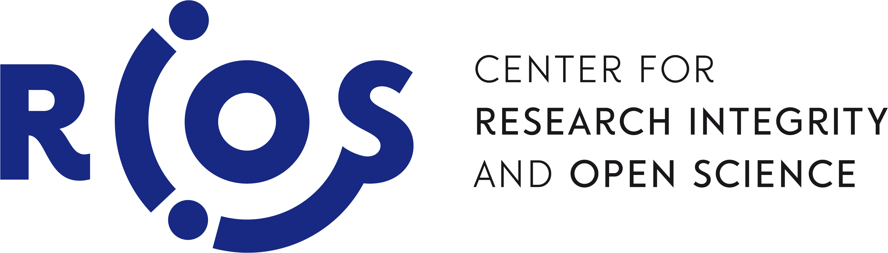

# Amsterdam UMC Open Science Awards 2026

**Supported by the [2nd Research Integrity and Open Science (RIOS) Collaborative Program 2026](https://rios-vu.nl/)**

[{ width="200" }](https://rios-vu.nl/)

---

## Call for applications

After the success of last year's edition, the Amsterdam UMC Open Science Awards are coming back! Do your research practices reflect a commitment to transparency, reproducibility, or accessibility? We encourage you to put your work forward for recognition across three distinct award categories.

🏆 Five winning projects will receive €100 each, and five runners-up will receive €50 each.

**Submission deadline:** September 30th 2026

**👉 [Submit your proposal through this form](https://forms.gle/CoAgDU4dFqM15e968)**

---

## Who can apply?

- **Researchers at any career stage**, from MSc students to senior researchers.
- **Affiliated with Amsterdam UMC** at some point during 2025 or 2026.
- **A project initiated or completed** in 2025 or 2026.

**Applied last year?** You are welcome to apply again, as long as your submission is for a different project from your previous one.

---

## Why should I apply?

In academia, we hand out awards for all kinds of contributions: best poster, best paper, best presentation, best dissertation. But the work that goes into making research open, transparent, and accessible often goes unrecognised. We think open science deserves to be celebrated too.

Beyond the recognition itself, an Open Science Award is a concrete addition to your CV. It signals that you actively contribute to better research practices, which matters more and more as research culture shifts toward openness.

If you are an early-career researcher who has experienced pushback for prioritising openness, this award can be especially meaningful. External recognition of your efforts is a useful counterweight when you have been told that open science "isn't worth the time" or "doesn't count for evaluation". Your work deserves to be seen.

And there is the prize money: every shortlisted applicant goes home with a monetary award.

---

## Award categories

There are three categories you can apply under. Each has its own scoring criteria (see [How applications are reviewed](#how-applications-are-reviewed)).

1. **Open Science as a Core Objective.** For projects where open science is the primary goal. This includes initiatives specifically designed to develop, promote, or systematically implement open science practices, such as building open infrastructure, developing open-science training programmes, or advancing reproducibility frameworks across your team/department.
2. **Open Science as a Research Component.** For research projects where open science practices play a meaningful but supporting role. This includes studies that incorporate preregistration, FAIR data sharing, open materials, registered reports, or open-source tools as part of a broader scientific investigation.
3. **Science Communication.** For projects that prioritize making science accessible, engaging, and understandable within and beyond the academic community. This includes public outreach, citizen science initiatives, open educational resources, or any effort to bridge the gap between research and society.

---

## Timeline

<table style="font-size: 1.1em;">
  <thead>
    <tr>
      <th>When</th>
      <th>What</th>
    </tr>
  </thead>
  <tbody>
    <tr>
      <td>Early May 2026</td>
      <td>Call for applications opens</td>
    </tr>
    <tr>
      <td>30 September 2026</td>
      <td>Submission deadline</td>
    </tr>
    <tr>
      <td>October 2026</td>
      <td>Review period; all applicants notified of the outcome</td>
    </tr>
    <tr>
      <td>5 November 2026</td>
      <td>Award ceremony with shortlisted pitches and winner announcements</td>
    </tr>
  </tbody>
</table>

---

## How the selection works

Applications are reviewed based on the materials submitted through the form. From all submissions, **10 applicants are shortlisted**, and **all 10 are guaranteed a monetary prize**.

At the award ceremony on November 5th, each shortlisted applicant gives a 5-minute pitch. The pitches determine the final distribution of prizes:

- 5 **winners** receive **€100** each
- 5 **runners-up** receive **€50** each

In other words, everyone who is shortlisted leaves with a prize.

---

## How applications are reviewed

Applications are scored on a combination of overall criteria (applied to all submissions) and project-specific criteria (which depend on the selected category).

### Overall criteria

1. **Quality of submission.** Overall impression of the application (clear, complete, compelling).
2. **Alignment with open science.** How well the project addresses the selected open science pillar, and whether the connection is clearly explained.
3. **Category assignment.** Whether the project fits the category the applicant selected. This is not a scoring criterion; it allows reviewers to move miscategorised applications to the most appropriate category.
4. **Depth of implementation.** Whether the open science contribution was implemented with genuine effort, in a considered and concrete way rather than superficially.
5. **Quality of the provided resources.** Overall quality of the materials submitted as supporting information.

### Project-specific criteria

#### Open Science as a Core Objective

- **Sustainability.** How likely the project is to remain active and maintained over time.
- **Reusability.** How easily the project can be adopted, adapted, or extended by others beyond the original team.
- **Novelty.** How innovative the open science contribution is.

#### Open Science as a Research Component

- **Integration.** How well the open science element is integrated into the research, rather than added as an afterthought.
- **Improvement.** How much the open science component enhances the quality, transparency, or reproducibility of the research itself.
- **Reusability.** How easily other researchers can pick up, understand, and adapt the open science component for their own work.

#### Science Communication

- **Accessibility.** How clear and accessible the communication is for the intended audience.
- **Creativity & engagement.** How creative and engaging the format or approach is.
- **Impact.** Whether there is evidence, or a realistic expectation, of meaningful engagement with the target audience.

---

## The pillars of open science

The application asks you to select the open science pillar that best fits your project. The pillars below describe the main dimensions of open science. Most everyday open science practices (like sharing code or preregistering a study) fall under **FAIR Data** or **Research Integrity**, but the broader set of pillars captures how diverse open science work can be.

1. **FAIR Data.** Making research data Findable, Accessible, Interoperable, and Reusable. This includes depositing data in a public repository with persistent identifiers, providing clear access conditions, using open file formats, and documenting and licensing it so others can build on it.

2. **Research Integrity.** Promoting transparency, reproducibility, and accountability in research. This includes preregistration, registered reports, openly sharing methods and analysis code, and other practices that make the research process verifiable.

3. **Next-Generation Metrics.** Moving beyond traditional research evaluation indicators like citation counts and journal impact factors. This includes altmetrics, qualitative indicators, and assessments of societal or clinical impact that better reflect a project's true value.

4. **Future of Scholarly Communication.** Making scientific publishing more open and accessible. This includes open access publishing, open peer review, and sharing preprints, all of which reduce barriers to scientific knowledge.

5. **Citizen Science.** Engaging the public, patients, or community members directly in the research process. This includes co-designing research questions, involving non-academics in data collection, or making findings directly accessible to audiences outside academia.

6. **Education & Skills.** Training and supporting researchers, students, and others in open science practices. This includes workshops, tutorials, open educational materials, and tools that lower the barrier to practising open science.

7. **Rewards & Incentives.** Promoting recognition of open science practices within teams, departments, and institutions. This includes advocating for open science in evaluation criteria, and embedding open science in research group culture.

---

!!! info "About the Open Science Guidebook"
    This awards initiative is part of the [Open Science Guidebook for Neuroscientists](../index.md), a resource from our open science working group. The guidebook offers step-by-step guidance on data management, preregistration, protocol and code sharing, and open-access publishing. It is designed for the diverse subfields of neuroscience and accessible to researchers at any career stage, with the aim of fostering collaboration, reproducibility, and transparency in the field.

    Parts of the site are still being updated, but you are very welcome to explore.

---

For any questions, reach out to **[open.science.anw@amsterdamumc.nl](mailto:open.science.anw@amsterdamumc.nl)**.
